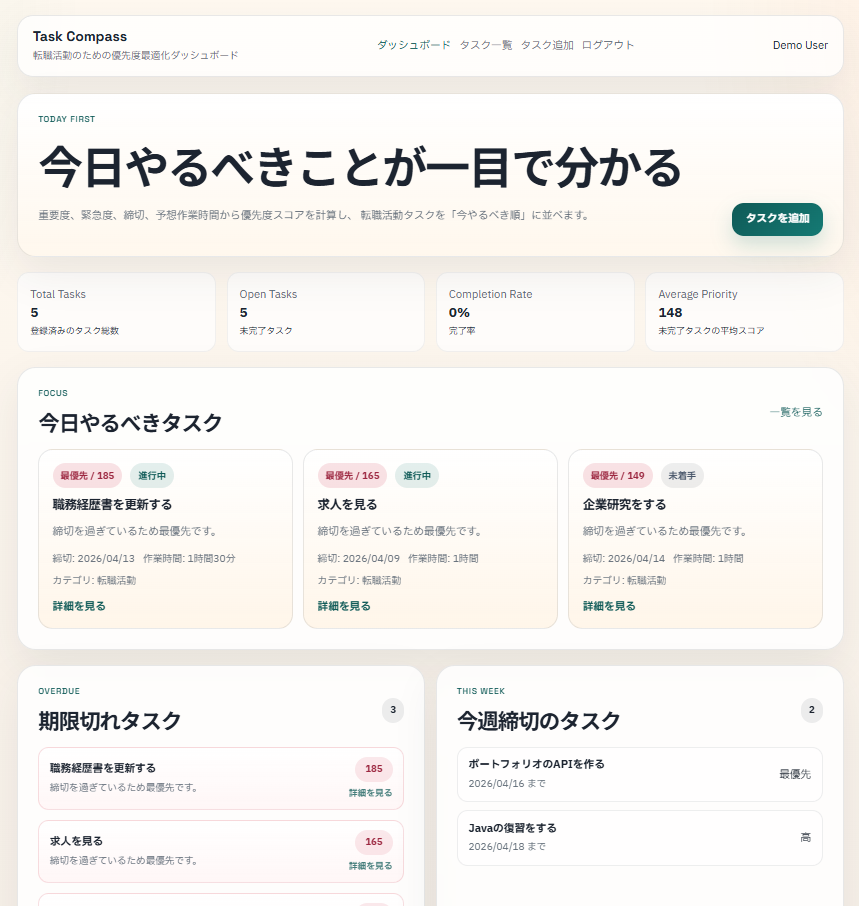
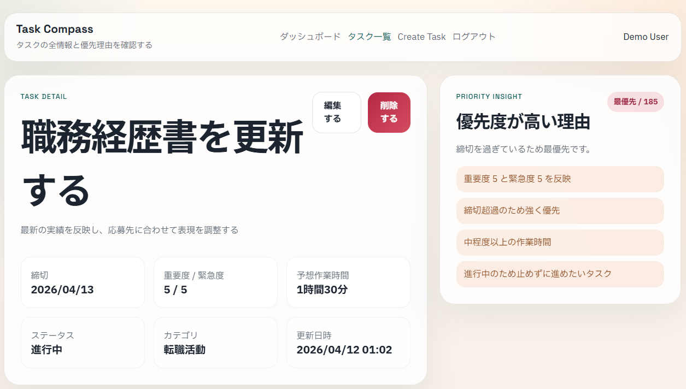

# Task Compass

Task Compass は、転職活動・学習・ポートフォリオ制作などのタスクを、優先度付きで整理する Web アプリケーションです。

単なる ToDo 管理ではなく、`重要度`、`緊急度`、`締切`、`予想作業時間`、`ステータス` をもとに優先度スコアを算出し、ユーザーが「今どのタスクから着手すべきか」を判断しやすくすることを目的にしています。

## 概要

タスクを登録すると、ダッシュボードで「今日やるべきタスク」「期限切れタスク」「今週締切のタスク」を確認できます。

各タスクには優先度スコアと理由文を表示し、なぜそのタスクを優先すべきかを画面上で確認できるようにしています。

## 制作背景

転職活動では、応募書類の更新、企業研究、面接準備、学習、ポートフォリオ改善など、性質の異なるタスクが同時に発生します。

通常の ToDo リストではタスクを登録することはできますが、次に何を優先すべきかはユーザー自身が毎回判断する必要があります。

そこで Task Compass では、タスクの属性から優先度を計算し、着手順を判断しやすくすることを目指しました。

初期実装では AI 支援を利用していますが、認証・認可、ユーザー単位のデータ分離、404 ハンドリング、テスト追加、設計ドキュメント整備は、コードを確認しながら改善しました。

## 画面イメージ

**ダッシュボード**

<p>
  
</p>

---

**タスク詳細**

<p>
  
</p>

## 主な機能

- ユーザー登録 / ログイン
- ログインユーザーごとのタスク管理
- タスクの作成 / 一覧 / 詳細 / 編集 / 削除
- ステータス、カテゴリ、並び替えによる絞り込み
- タスク一覧のページネーション
- ダッシュボードでのタスク可視化
- 優先度スコアの算出
- 優先度が高い理由の表示
- 他ユーザーのタスクにアクセスできないようにする制御
- 存在しないタスクや権限のないタスクへのアクセス時の 404 応答
- GitHub Actions による自動テスト

## 技術構成

- Java 21
- Spring Boot
- Spring Security
- Thymeleaf
- MyBatis
- H2
- PostgreSQL
- JUnit 5
- MockMvc
- GitHub Actions

詳細は [技術概要](./docs/technical-overview.md) にまとめています。

## 関連ドキュメント

- [技術概要](./docs/technical-overview.md): 技術選定理由、AI 生成後に見直した点、設計判断、悩んだ点、捨てた選択肢、現在の限界をまとめています。
- [優先度スコア設計](./docs/priority-scoring.md): 優先度スコアの計算方針、評価軸、現在の制約をまとめています。

## ローカル起動

デフォルトでは H2 のインメモリ DB を使用するため、DB を事前に用意しなくても起動できます。
通常起動ではデモデータは作成されないため、初回アクセス後にユーザー登録して利用します。

```powershell
.\mvnw.cmd spring-boot:run
```

起動後、以下にアクセスします。

[http://localhost:8080/login](http://localhost:8080/login)

デモユーザーとサンプルタスクを自動作成したい場合は、以下のように `dev` プロファイルを有効にして起動します。

```powershell
.\mvnw.cmd spring-boot:run -Dspring-boot.run.profiles=dev
```

- メールアドレス: `demo@example.com`
- パスワード: `password123`

## PostgreSQL を使う場合

データを永続化したい場合は、`config/application-example.properties` をコピーして `config/application.properties` を作成します。

```powershell
Copy-Item .\config\application-example.properties .\config\application.properties
```

作成後、以下の値を自分の PostgreSQL 環境に合わせて編集します。

- `TASK_COMPASS_DB_URL`
- `TASK_COMPASS_DB_USERNAME`
- `TASK_COMPASS_DB_PASSWORD`

`config/application.properties` は `.gitignore` に含めているため、ローカル設定やパスワードは Git 管理されません。

## 今後の改善予定

- 優先度スコアの重みづけを設定可能にする
- MyBatis の SQL を XML Mapper に移し、長い SQL の見通しを改善する
- 本番運用を想定した独自エラー画面やログ出力を整備する
