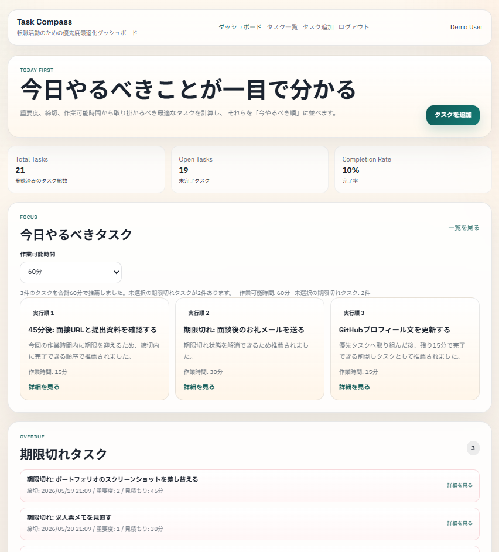
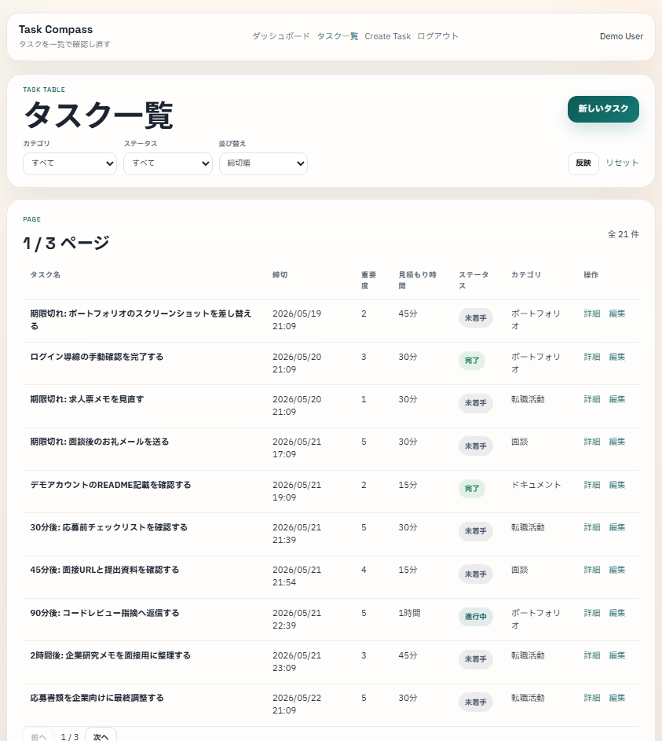

# Task Compass

[](https://github.com/Kanbara-214/Task-Compass/actions/workflows/ci.yml)

Task Compass は、転職活動や学習のように複数のタスクが並行する場面で、作業可能時間内にどのタスクをどの順番で進めるべきかを推薦するタスク管理アプリです。

単なる ToDo 管理ではなく、`重要度`、`締切`、`予想作業時間`、`作業可能時間` をもとに、今日取り組むべきタスク列を提示します。

## 公開URL

[https://task-compass-imwb.onrender.com](https://task-compass-imwb.onrender.com)

2026-05-22 時点で、公開URLへのアクセスとデモアカウントでのログインを確認済みです。

デモアカウントでログインできます。

- メールアドレス: `demo@example.com`
- パスワード: `password123`

## このポートフォリオで見てほしい点

- Spring Security による認証・認可
- `ownerId` を使ったユーザー単位のデータ分離
- 他ユーザーのタスクにアクセスできないことを確認するテスト
- 作業可能時間内で推薦タスク列を選ぶ `TaskRecommendationService`
- 動的計画法を使った推薦ロジック
  - [優先度計算ロジックの改修 PR #12](https://github.com/Kanbara-214/Task-Compass/pull/12)
  - [タスク推薦ロジック設計](./docs/recommendation-logic.md)
- 旧スコアリングから新推薦ロジックへ段階的に移行した開発履歴
  - [従来の優先度計算ロジック削除 PR #13](https://github.com/Kanbara-214/Task-Compass/pull/13)
  - [技術概要: 工夫した点](./docs/technical-overview.md#工夫した点)
- issue / PR / docs を使った仕様整理
- GitHub Actions による自動テスト

## 動作確認

- 自動テスト: `./mvnw.cmd test` 40件成功
- CI: GitHub Actions で `push` / `pull_request` 時に `./mvnw test` を実行
- 公開環境: Render 上でデモログインとダッシュボード表示を確認済み

## 制作背景

転職活動では、応募書類の更新、企業研究、面接準備、学習、ポートフォリオ改善など、性質の異なるタスクが同時に発生します。

通常の ToDo リストではタスクを登録することはできますが、次に何を優先すべきかはユーザー自身が毎回判断する必要があります。

そこで Task Compass では、タスクの属性と作業可能時間から推薦タスク列を計算し、今日の着手順を判断しやすくすることを目指しました。

初期実装では AI 支援を利用していますが、認証・認可、ユーザー単位のデータ分離、404 ハンドリング、テスト追加、設計ドキュメント整備は、コードを確認しながら改善しました。

## 画面イメージ

**ダッシュボード**

<p>
  
</p>

---

**タスク一覧**

<p>
  
</p>

## 主な機能

- ユーザー登録 / ログイン
- ログインユーザーごとのタスク管理
- タスクの作成 / 一覧 / 詳細 / 編集 / 削除
- ステータス、カテゴリ、並び替えによる絞り込み
- タスク一覧のページネーション
- ダッシュボードでのタスク可視化
- 作業可能時間に応じたタスク推薦
- 各推薦タスクの推薦理由表示
- 他ユーザーのタスクにアクセスできないようにする制御
- 存在しないタスクや権限のないタスクへのアクセス時の 404 応答
- GitHub Actions による自動テスト

## 技術構成

- Java 21
- Spring Boot
- Spring Security
- Thymeleaf
- MyBatis
- H2
- PostgreSQL
- JUnit 5
- MockMvc
- GitHub Actions

詳細は [技術概要](./docs/technical-overview.md) にまとめています。

## 関連ドキュメント

- [技術概要](./docs/technical-overview.md): 技術選定理由、AI 生成後に見直した点、設計判断、工夫した点、捨てた選択肢、現在の課題をまとめています。
- [タスク推薦ロジック設計](./docs/recommendation-logic.md): 作業可能時間内で推薦タスク列を作る計算方針、評価軸、現在の制約をまとめています。

## ローカル起動

デフォルトでは H2 のインメモリ DB を使用するため、DB を事前に用意しなくても起動できます。
通常起動ではデモデータは作成されないため、初回アクセス後にユーザー登録して利用します。

```powershell
.\mvnw.cmd spring-boot:run
```

起動後、以下にアクセスします。

[http://localhost:8080/login](http://localhost:8080/login)

PostgreSQL を使う場合の設定例は `config/application-example.properties` を参照してください。
